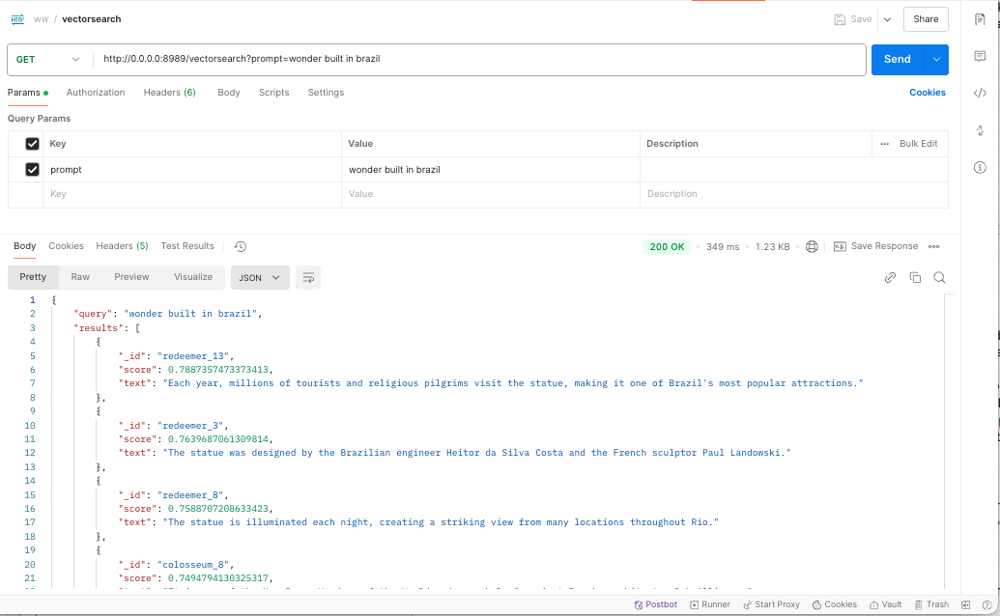

# Wonders of the World: A Vector Search Demo App

This application demonstrates a vector search functionality using MongoDB Atlas and Sentence Transformers. It allows users to search for fun facts about the Wonders of the World based on semantic similarity to a given prompt.

## Features

- **Vector Search Endpoint**: A `/vectorsearch` endpoint that accepts a query parameter `prompt` and returns documents similar to the prompt based on their vector embeddings.
- **MongoDB Atlas Integration**: Utilizes MongoDB Atlas for storing documents and performing vector searches.
- **Sentence Transformers**: Uses the `nomic-ai/nomic-embed-text-v1` model to generate vector embeddings for documents and search queries.

## Usage

1. **Setup the Database**: Ensure MongoDB Atlas is configured and the necessary search index is created. We showcase Pulumi to complete this step in a consistent manner.
2. **Run the Application**: Start the Flask application using Docker or directly with Python.
3. **Perform a Vector Search**: Use the `/vectorsearch` endpoint to find documents similar to a given prompt.

### Example

To see the endpoint in action, you can use Postman or any other API testing tool. Below is an example of how to perform a vector search using Postman:



1. Set the request method to `GET`.
2. Enter the URL: `http://127.0.0.1:5555/vectorsearch?prompt=example`
3. Replace `example` with your search query.
4. Send the request and view the results.

## Running the Application

### Environment Variables

Create a `.env` file in the app directory of the project with the following content:

```
MONGO_URI=your_mongodb_uri
FLASK_RUN_PORT=8080
```

Replace `your_mongodb_uri` with the actual MongoDB connection string.

### Using Docker

1. Build the Docker image:
    ```sh
    docker build -t ww .
    ```
2. Run the Docker container:
    ```sh
    docker run -p 5555:8080 --env-file .env ww
    ```

### Using Python

1. Install the required dependencies:
    ```sh
    pip install -r app/requirements.txt
    ```
2. Run the Flask application:
    ```sh
    python app/app.py
    ```

## Infrastructure as Code

This demo application's cloud resources, including the vector search database and peripherals, can be deployed using Pulumi infrastructure as code written in Python. The Pulumi configuration files are located in the [infra](./infra/) folder.

To deploy the infrastructure:

1. Navigate to the [infra](./infra/) folder:
    ```sh
    cd infra
    ```
2. Install the required dependencies:
    ```sh
    pip install -r requirements.txt
    ```
3. Configure your Pulumi stack and deploy the resources:
    ```sh
    pulumi up
    ```

## License

This project is licensed under the MIT License.